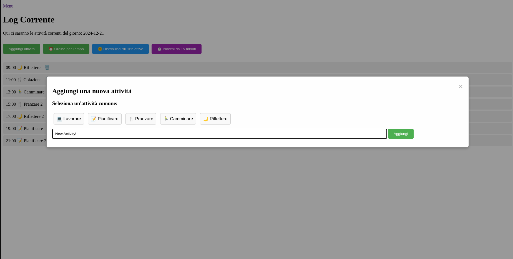
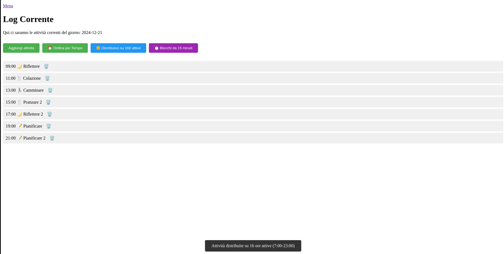

### Greetings for Today!!! 😊

# Scala-Plan-AI

Scala-Plan-AI is a project developed using the Play Framework with the Scala programming language. Its goal is to showcase how Scala skills can be applied to create innovative, scalable, and high-performance projects. This initiative marks the first step toward exploring advanced technologies for managing daily tasks and structured software development.

The project aims to build an organizational management application with both dynamic and static menus, daily logs, and interactive elements. The objective is to develop an efficient, user-friendly web app for planning and tracking activities.

---

### New Task Loading Demo 💻

In this section, users can add new tasks to their to-do list or time tracking sheet. The interface allows users to easily input new activities and assign them relevant details for better task management. Below is a demo showing how the new tasks are added dynamically to the application.




This functionality enhances productivity and provides an intuitive way to manage daily activities within the app.

---

## Development Time Tracking ⏰

| Date       | Time       | Hours Spent | Task Description                                                                                                                                                                                       |
|------------|------------|-------------|--------------------------------------------------------------------------------------------------------------------------------------------------------------------------------------------------------|
| 2024-12-21 | 09:50-14:20| 4.5         | Added support for CRUD (Create, Read, Update, Delete) functions in task management. Implemented 3 new buttons for smart sorting: one for standard time sorting, one for distributing tasks throughout the workday (9:00 AM - 11:00 PM), and one for splitting them into 15-minute blocks. Created a menu for navigating tasks and their sorting. Also implemented intelligent movement of items between rows, adjusting their position based on priority and temporal distribution. Added two buttons that, when clicked, reorganize tasks into 16-hour time blocks (from 9:00 AM to 11:00 PM) and distribute tasks into 15-minute intervals. When the user clicks one of these buttons, a "toast" appears, which is a temporary, non-intrusive notification that confirms the action was successfully completed. The "toast" is a small notification that appears on the screen to inform the user of an event without disrupting the user interface. |

**2024-12-20**

| Date       | Time       | Hours Spent | Task Description                                                                                                                                                                          |
|------------|------------|-------------|-------------------------------------------------------------------------------------------------------------------------------------------------------------------------------------------|
| 2024-12-20 | 09:00-10:30| 1.5         | Review of all tasks completed yesterday, team meeting in Scrum/Agile mode with ChatGPT 4, HR meetings, and day organization.                                                               |
| 2024-12-20 | 15:15-16:45| 1.5         | Improved the current log page, added dynamic popup to allow users to add a new task to the to-do list with JavaScript and CSS.                                                             |

---

**2024-12-19**

| Date       | Time  | Hours Spent | Task Description                                                                                                                                                                       |
|------------|-------|-------------|----------------------------------------------------------------------------------------------------------------------------------------------------------------------------------------|
| 2024-12-19 | 14:30 | 1           | Brainstorming ideas to solve life and task organization problems.                                                                                                                      |
| 2024-12-19 | 16:30 | 1           | Installed Scala and completed the first theoretical lesson and "Hello World."                                                                                                          |
| 2024-12-19 | 17:30 | 1           | First theoretical lesson on Scala and creating a "Hello, Scala!" program.                                                                                                               |
| 2024-12-19 | 18:30 | 1           | Started the project `scala-plan-ai`: Set up Play Framework, routes, controllers, views, and added the "About" page with a festive fireplace image using ChatGPT's assistance (DALL-E). |
| 2024-12-19 | 21:30 | 1           | Released the project on GitHub, organized repository files, and logged work hours.                                                                                                     |

---

## Why Scala? A Strategic Choice
Scala was chosen for this project for several strategic and technical reasons, making it particularly suited for future and innovative projects. Compared to Java and Python, Scala offers a unique balance between:

1. **Power and Conciseness:**
   - Scala combines the robustness of Java with the modern, concise syntax of functional languages.
   - Scala code is often shorter and more readable than Java, reducing the risk of errors and speeding up development.

2. **Scalability:**
   - Designed for distributed systems and large-scale applications, Scala is an ideal choice for innovative and "scalable" projects.
   - Its compatibility with the Java ecosystem allows leveraging established libraries and integrating with legacy systems.

3. **Technical Innovation:**
   - Unlike Python, Scala offers static typing support, increasing robustness and reducing bugs.
   - The combination of object-oriented and functional programming allows writing highly modular and reusable code.

4. **Efficiency in Workflows:**
   - Native integration with tools like SBT (Scala Build Tool) facilitates dependency management and project lifecycle automation.
   - Support for the reactive paradigm, thanks to frameworks like Akka, enables the development of high-performance and resilient applications.

5. **Market Value:**
   - Mastery of Scala demonstrates to HR and business decision-makers an ability to adapt to emerging technologies and a commitment to future-proof skills.
   - Scala is used in big data contexts (Spark) and machine learning, making it a strategic skill for technological trends.

In summary, the choice of Scala is not just a technical decision but a strategic vision to face future challenges with appropriate tools and an innovative approach.

---

## Project Overview

### Getting Started

Here are the steps to get started with this project:

1. **Install SDKMAN and Scala:**
   ```bash
   curl -s "https://get.sdkman.io" | bash
   source "$HOME/.sdkman/bin/sdkman-init.sh"
   sdk install scala
   scala -version
   ```

2. **Create a new Scala project with Play Framework:**
   ```bash
   sbt new playframework/play-scala-seed.g8
   name [play-scala-seed]: scala-plan-ai
   organization [com.example]: com.plan.ai
   play_version [3.0.6]: 
   scala_version [2.13.15]: 
   sbt_giter8_scaffold_version [0.17.0]: 
   ```

3. **Run the project:**
   ```bash
   cd scala-plan-ai
   sbt run
   ```
   The project will be available at: [http://localhost:9000/](http://localhost:9000/)

4. **Clean up the environment (optional):**
   ```bash
   rm -rf ~/.sbt
   rm -rf ~/.ivy2
   ```

5. **Auto-reloading for rapid development:**
   ```bash
   sbt ~run
   ```

---
